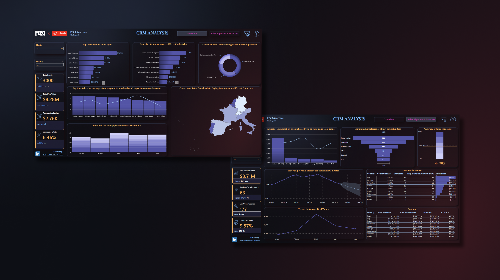

# CRM & Sales Pipeline Analysis

## Introduction
This project is part of the FP20 Analytics Challenge 17, focusing on CRM and sales pipeline data analysis to derive actionable insights. The challenge involves examining sales performance, conversion rates, sales pipeline health, and forecasting future trends using advanced data analytics techniques.

## Problem Statement
The primary objective of this project is to address the following business questions:
1. Who are the top-performing sales agents?
2. What are the conversion rates from leads to paying customers in different countries?
3. How does sales performance vary across different industries?
4. How healthy is the sales pipeline month-over-month, considering the number of leads at each stage of the sales funnel?
5. What is the average time taken by sales agents to respond to new leads, and how does it impact conversion rates?
6. What are the trends in average deal values? Are there noticeable fluctuations?
7. Based on current pipeline data and historical trends, forecast potential income for the next few months.
8. Does the size of the organization affect the sales cycle duration and deal value?
9. How effective are sales strategies for different products offered (e.g., SAAS vs. other product types)?
10. Assess the time taken from lead acquisition to deal closure. Which factors influence the duration of the sales cycle?
11. Investigate the common characteristics of lost opportunities and how these reasons vary by industry or country.
12. How accurate are the sales forecasts in terms of expected versus actual close dates?

## Skills Demonstrated
- Data Cleaning and Transformation
- Data Visualization using Power BI
- Descriptive and Predictive Analytics
- Statistical Analysis
- Business Intelligence
- Data Interpretation and Insight Generation
- Dashboard
- DAX Measure
- Implement UI/UX
- Next Level KPI

## Data Sourcing
The dataset used in this project is provided as part of the FP20 Analytics Challenge 17. The dataset contains anonymized CRM and sales pipeline information, including details about leads, deals, sales agents, industries, countries, and more. The dataset is utilized to analyze sales performance, conversion rates, sales pipeline health, response times, deal values, and other key metrics in the sales domain.

More Information About This Challenge: [FP20 Analytics Challenge 17](https://zoomcharts.com/en/microsoft-power-bi-custom-visuals/challenges/fp20-analytics-july-2024)

## Data Transformation
Data transformation involved the following steps:
1. **Data Cleaning**: Removing duplicates, handling missing values, and correcting inconsistencies.
2. **Data Aggregation**: Summarizing data by month, sales agent, industry, and country.
3. **Feature Engineering**: Creating new features such as month-over-month changes, response times, and sales cycle duration.

## Modeling
The project involved creating various models to derive insights:
1. **Descriptive Models**: To understand current and historical sales performance.
2. **Predictive Models**: Using historical data to forecast future sales trends and potential income.
3. **Diagnostic Models**: Analyzing factors influencing sales performance, conversion rates, and deal values.

In this project, I created a calendar table to facilitate time-based analysis. The calendar table contains information about dates, months, years, quarters, and more, which allows for better data analysis based on time dimensions. The calendar table is also used to create time relationships in the data model.

| DAX | Result |
|----------|----------|
|  |  |

And Create Relationship between Date Table and Fact Table

Various DAX measures were used to calculate time-based metrics and other analyses. These measures helped in analyzing trends and identifying patterns in the CRM data. Some of the key DAX measures include:

KPI Card

Detailed KPI

Reference KPI

Accuracy

## Analyze & Visualization
The analysis and visualization were done using Power BI to create an interactive dashboard. Key visualizations include:
- Sales Agent Performance
- Conversion Rates by Country
- Sales Performance by Industry
- Sales Pipeline Health Month-over-Month
- Response Time Impact on Conversion Rates
- Average Deal Value Trends
- Forecasted Revenue
- Sales Cycle Duration by Organization Size
- Product Strategy Effectiveness
- Influencers of Sales Cycle Duration
- Characteristics of Lost Opportunities
- Forecast Accuracy

### In this project there are 2 pages :
- Overview
- Sales Pipeline & Forecast

You can interact with report here [FP20 Analytics Challenge 15 Dashboard](https://zoomcharts.com/en/microsoft-power-bi-custom-visuals/challenges/submission/f2a84cd464a908a144272b7eb158b079?challenge=fp20-analytics-april-2024)

## Conclusion
The analysis provided several key insights:
- **Top-performing Sales Agents**: Laura Thompson, Michael Brown, and Jessica Martinez lead in total sales.
- **Conversion Rates**: Netherlands and Belgium have the highest conversion rates at 8.70%.
- **Industry Performance**: Transportation & Logistics tops the Deal Value charts with $1.44M.
- **Sales Pipeline Health**: Stable month-over-month lead count with significant variations at different sales funnel stages.
- **Response Time Impact**: Faster responses correlate with higher conversion rates.
- **Deal Value Trends**: Noticeable fluctuations with peaks in March and decreases in April and May.
- **Potential Revenue Forecast**: Upward trend until December 2024, with potential decline thereafter.
- **Sales Cycle Duration**: Medium-sized organizations have shorter cycles and highest transaction value.
- **Product Strategy Effectiveness**: Services outperform SAAS in deal closure rate.
- **Sales Cycle Influencers**: Switzerland has the longest sales cycle duration; Telecommunications industry shows long duration.
- **Lost Opportunities**: Initial Contact stage sees the highest number of lost deals.
- **Forecast Accuracy**: Overall accuracy stands at 44.78% based on Deal Value and Probability.

